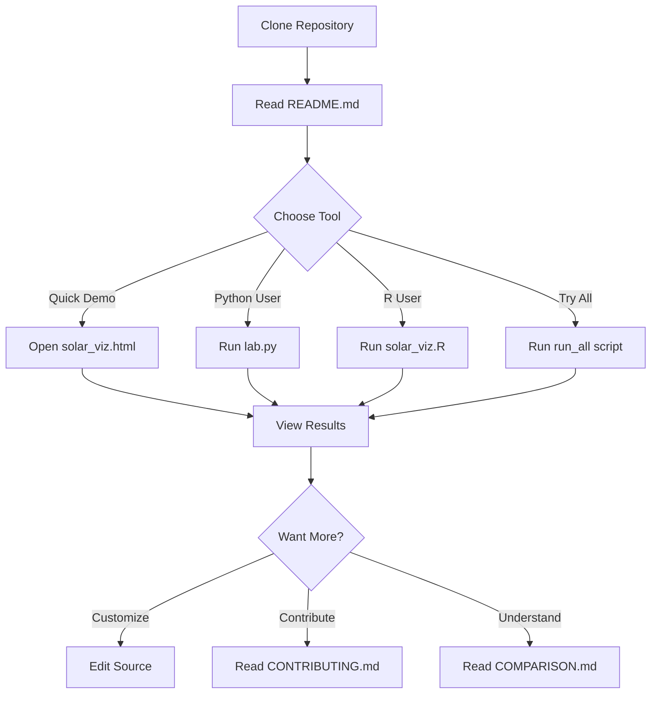

# 📁 Project Structure

Complete directory structure of the Solar Radiation Visualization Suite.

```
solar-radiation-viz/
│
├── 📊 Core Implementations
│   ├── lab.py                      # Python + Matplotlib (original)
│   ├── solar_viz.R                 # R + ggplot2
│   ├── solar_viz.cpp               # C++ + Gnuplot
│   ├── solar_viz.html              # D3.js Interactive Web
│   ├── solar_viz.gnu               # Pure Gnuplot Script
│   └── solar_viz.pde               # Processing Animated
│
├── 🚀 Automation Scripts
│   ├── run_all.bat                 # Windows batch runner
│   └── run_all.sh                  # Unix/Linux/macOS shell runner
│
├── 📚 Documentation
│   ├── README.md                   # Main project README (GitHub homepage)
│   ├── QUICK_START.md              # Fast setup guide
│   ├── README_visualizations.md    # Detailed installation guide
│   ├── COMPARISON.md               # Tool comparison matrix
│   ├── CONTRIBUTING.md             # Contribution guidelines
│   ├── CHANGELOG.md                # Version history
│   └── PROJECT_STRUCTURE.md        # This file
│
├── 📄 Legal & Config
│   ├── LICENSE                     # MIT License
│   └── .gitignore                  # Git ignore patterns
│
├── 🖼️ Generated Outputs (examples)
│   ├── Fig-1.png                   # Python output - radiation
│   └── Fig-2.png                   # Python output - variables
│
└── 📋 GitHub Configuration
    └── .github/
        ├── FUNDING.yml             # Funding/sponsorship links
        ├── pull_request_template.md # PR template
        └── ISSUE_TEMPLATE/
            ├── bug_report.md       # Bug report template
            ├── feature_request.md  # Feature request template
            └── new_implementation.md # New language/tool proposal
```

## 📊 File Count by Type

| Category             | Count | Purpose                          |
| -------------------- | ----- | -------------------------------- |
| **Implementations**  | 6     | Different language/tool versions |
| **Documentation**    | 7     | Guides and references            |
| **Scripts**          | 2     | Automation runners               |
| **GitHub Templates** | 5     | Issue/PR management              |
| **Config Files**     | 2     | License, gitignore               |
| **Total Files**      | 22+   | Complete repository              |

## 🎯 File Purposes

### Core Implementation Files

| File             | Language   | Lines of Code | Dependencies                 |
| ---------------- | ---------- | ------------- | ---------------------------- |
| `lab.py`         | Python     | ~80           | pandas, numpy, matplotlib    |
| `solar_viz.R`    | R          | ~120          | ggplot2, gridExtra, reshape2 |
| `solar_viz.cpp`  | C++        | ~180          | gnuplot (external)           |
| `solar_viz.html` | JavaScript | ~510          | D3.js (CDN)                  |
| `solar_viz.gnu`  | Gnuplot    | ~150          | gnuplot                      |
| `solar_viz.pde`  | Processing | ~280          | Processing IDE               |

### Documentation Files

| File                       | Purpose               | Target Audience             |
| -------------------------- | --------------------- | --------------------------- |
| `README.md`                | Main project overview | Everyone (first impression) |
| `QUICK_START.md`           | Fast setup guide      | Beginners                   |
| `README_visualizations.md` | Detailed installation | Developers                  |
| `COMPARISON.md`            | Tool comparison       | Decision makers             |
| `CONTRIBUTING.md`          | Contribution guide    | Contributors                |
| `CHANGELOG.md`             | Version history       | Maintainers                 |
| `PROJECT_STRUCTURE.md`     | This file             | Developers                  |

### Generated Output Files

When you run all implementations, you'll get:

```
Generated Files/
├── Python/
│   ├── Fig-1.png                   # Radiation components
│   └── Fig-2.png                   # Input variables
│
├── R/
│   ├── radiation_components_R.png  # Main radiation plot
│   ├── input_variables_R.png       # Variables faceted
│   └── heatmap_R.png               # Correlation matrix
│
├── C++/
│   ├── radiation_cpp.png           # Radiation plot
│   ├── variables_cpp.png           # Variables plot
│   ├── data_*.txt                  # Data files (7 files)
│   ├── plot1.gnu                   # Generated script
│   └── plot2.gnu                   # Generated script
│
└── Gnuplot/
    ├── radiation_gnuplot.png       # 4-panel multiplot
    └── radiation_polar.png         # Polar/radar plot
```

## 🔧 Typical Workflow



## 📦 Dependencies Summary

### Required for Each Implementation

**Python:**

```bash
pip install pandas numpy matplotlib
```

**R:**

```R
install.packages(c("ggplot2", "gridExtra", "scales", "reshape2"))
```

**C++:**

```bash
# Compiler + gnuplot
g++, gnuplot
```

**D3.js:**

```
None! (Uses CDN, just need a browser)
```

**Gnuplot:**

```bash
gnuplot
```

**Processing:**

```
Processing IDE (https://processing.org)
```

## 🎨 Color Scheme Consistency

All implementations try to use consistent colors:

| Element               | Color  | Hex Code  |
| --------------------- | ------ | --------- |
| Total Radiation (G)   | Red    | `#E74C3C` |
| Diffuse Radiation (D) | Green  | `#27AE60` |
| Direct Beam (B)       | Blue   | `#3498DB` |
| Relative Humidity (R) | Blue   | `#3498DB` |
| Sunshine Hours (h)    | Red    | `#E74C3C` |
| Max Duration (N)      | Orange | `#F39C12` |
| Absolute Humidity (W) | Purple | `#9B59B6` |

## 🚀 Repository Size

| Item                    | Approximate Size |
| ----------------------- | ---------------- |
| Source Code             | ~15 KB           |
| Documentation           | ~50 KB           |
| Generated Images        | ~500 KB (varies) |
| **Total (no images)**   | **~65 KB**       |
| **Total (with images)** | **~565 KB**      |

_Very lightweight repository!_

## 🔄 Version Control Strategy

```
Main Branch (master)
    │
    ├── All stable implementations
    ├── Complete documentation
    └── Working automation scripts

Feature Branches
    │
    ├── feature/new-implementation
    ├── feature/enhanced-viz
    └── bugfix/issue-number
```

## 📱 Platform Support

| Platform | Python | R   | C++ | D3.js | Gnuplot | Processing |
| -------- | ------ | --- | --- | ----- | ------- | ---------- |
| Windows  | ✅     | ✅  | ✅  | ✅    | ✅      | ✅         |
| macOS    | ✅     | ✅  | ✅  | ✅    | ✅      | ✅         |
| Linux    | ✅     | ✅  | ✅  | ✅    | ✅      | ✅         |
| Web      | ❌     | ❌  | ❌  | ✅    | ❌      | ❌         |

## 🎯 Quick Navigation

**For Users:**

- Start here: [`README.md`](README.md)
- Quick setup: [`QUICK_START.md`](QUICK_START.md)
- Tool selection: [`COMPARISON.md`](COMPARISON.md)

**For Developers:**

- Installation: [`README_visualizations.md`](README_visualizations.md)
- Contributing: [`CONTRIBUTING.md`](CONTRIBUTING.md)
- Structure: This file

**For Maintainers:**

- Version history: [`CHANGELOG.md`](CHANGELOG.md)
- GitHub templates: `.github/`

---

_This structure is designed to be intuitive, maintainable, and contributor-friendly!_
